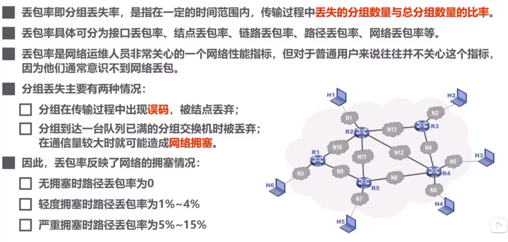
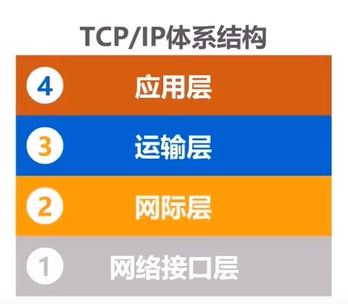

# 概述

# 交换
## 电路交换

## 分组交换

## 报文交换

# 计算机网络的定义

# 计算机网络的分类
1 交换方式

2 使用者

3 传输介质

4 覆盖范围

5 拓扑结构
+ 总线型
+ 星型
+ 环型
+ 网状型

# 计算机网络的性能指标

## 速率

## 带宽

木桶效应

## 吞吐量
下载速率和上传速率的总和

## 时延

## 时延带宽积

## 往返时间

## 利用率

## 丢包率

# 计算机网络体系结构
## 常见的计算机网络体系结构
### 法律上的国际标准

### 事实上的国际标准

### 学习的体系结构

## 术语

# 物理层

 

# 网络层

